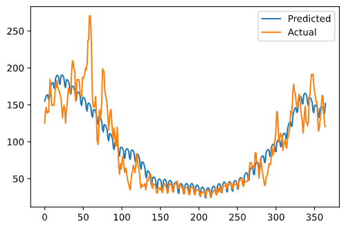
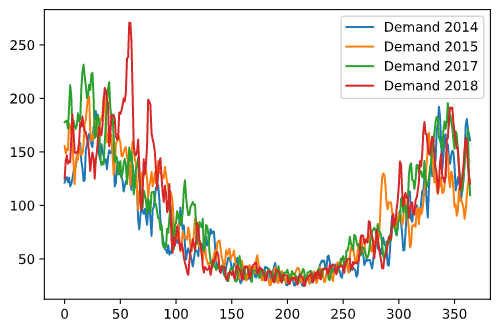
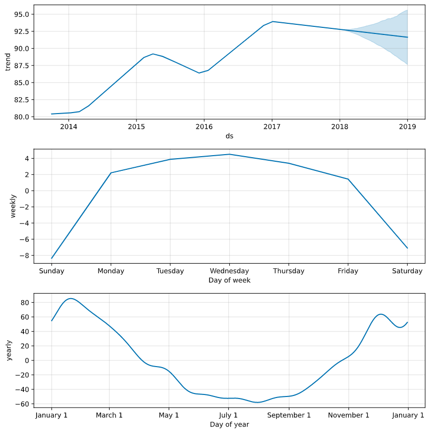

# Forecasting

fbProphet was used as a base prediction, with multiplicative seasonality

However there is scope to improve the mapping of the higher volatility in the winter months

Though 2018 is  different from the previous years

Plotting out the components shows the weekly and annual seasonality shows clearly, along with a trend.

